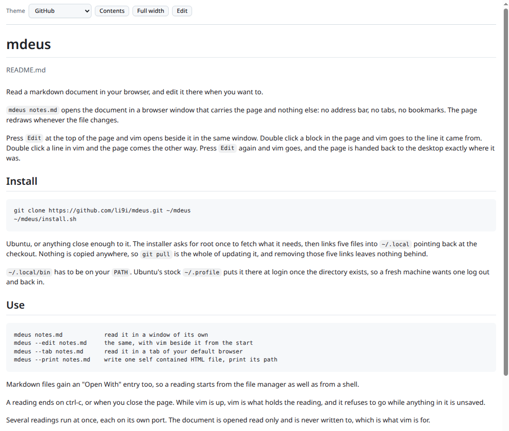

# mdeus

Read a markdown document in your browser, and edit it there when you want to.

<p align="center">
  
</p>

`mdeus notes.md` opens the document in a browser window that carries the page and nothing else: no address bar, no tabs, no bookmarks. The page redraws whenever the file changes.

Press `Edit` at the top of the page and vim opens beside it in the same window. Double click a block in the page and vim goes to the line it came from. Double click a line in vim and the page comes the other way. Press `Edit` again and vim goes, and the page is handed back to the desktop exactly where it was.

## Install

```bash
git clone https://github.com/li9i/mdeus.git ~/mdeus
~/mdeus/install.sh
```

Ubuntu, or anything close enough to it. The installer asks for root once to fetch what it needs, then links five files into `~/.local` pointing back at the checkout. Nothing is copied anywhere, so `git pull` is the whole of updating it, and removing those five links leaves nothing behind.

`~/.local/bin` has to be on your `PATH`. Ubuntu's stock `~/.profile` puts it there at login once the directory exists, so a fresh machine wants one log out and back in.

## Use

```
mdeus notes.md            read it in a window of its own
mdeus --edit notes.md     the same, with vim beside it from the start
mdeus --tab notes.md      read it in a tab of your default browser
mdeus --print notes.md    write one self contained HTML file, print its path
```

Markdown files gain an "Open With" entry too, so a reading starts from the file manager as well as from a shell.

A reading ends on ctrl-c, or when you close the page. While vim is up, vim is what holds the reading, and it refuses to go while anything in it is unsaved.

Several readings run at once, each on its own port. The document is opened read only and is never written to, which is what vim is for.

## What it renders

The markdown GitHub renders, so a document reads here the way it reads there: tables, strikethrough, task lists, footnotes, bare addresses, emoji shortcodes and the five `> [!NOTE]` callouts. Three themes to choose between, and a copy button on every fence.

No mathematics, no mermaid diagrams and no syntax highlighting, because each of the three would need something fetched from the network, and nothing here fetches anything.

## What it needs

Python 3, Chrome or Chromium for the window with nothing in it but the page, and a vim built with `+clientserver` and a GUI for the `Edit` toggle. Without Chrome or Chromium a reading opens in an ordinary tab instead. On Ubuntu the installer fetches all of it:

```
python3-markdown-it  python3-mdit-py-plugins  python3-linkify-it
python3-emoji  python3-xlib  python3-pil  vim-gtk3
```

Everything else is the standard library. Nothing is fetched at runtime, no page loads an external font, script or stylesheet, and the server listens on `127.0.0.1` and nowhere else.

## More

[How it works](docs/how-it-works.md) covers the `Edit` toggle, the sync between the two halves, the themes and the page, and what each file in the repository does.

[Checks](docs/checks.md) is the test command, and the manual list to walk after touching anything to do with the browser, the windows or vim.

## Licence

[MIT](LICENSE), with one exception. The application icon under `share/icons` was cut from Buuf by Paul Davey, which is Creative Commons Attribution-NonCommercial-ShareAlike, so those two PNG files carry that licence instead and may not be used commercially. Nothing depends on them: delete them, or put your own image there, and everything left is MIT.

The stylesheet embeds seven of GitHub's Octicons, which are MIT too. [NOTICE](NOTICE) carries their notice and the full detail on both.
